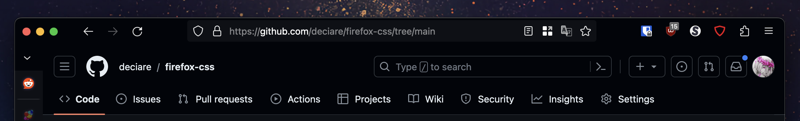
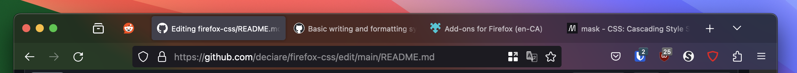
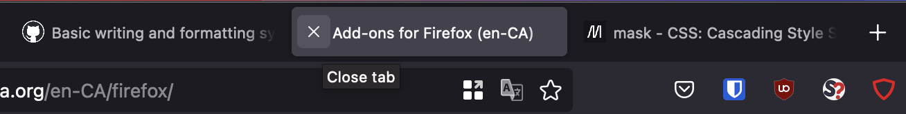
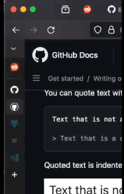
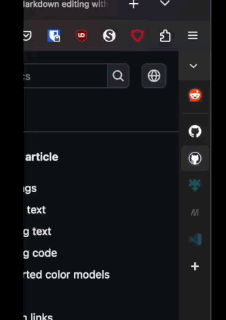

# Deciare's Firefox CSS hacks

A collection customisations to Firefox and Sidebery implemented via userChrome.css and [Sidebery](https://addons.mozilla.org/en-US/firefox/addon/sidebery/)'s built-in Style Editor.

# Setting up userChrome.css

Refer to https://www.reddit.com/r/FirefoxCSS/comments/73dvty/tutorial_how_to_create_and_livedebug_userchromecss/ for a guide on how to set up **userChrome.css** with live debugging.

# Modules

This repository is set up as a collection of modules that can be independently enabled by importing them into **userChrome.css**. For example, the following lines in **userChrome.css** will enable the toolbar vibrancy effect on macOS and move tab close buttons to the left:

```css
@import url(firefox/macVibrantToolbars.css);
@import url(firefox/tabCloseButtonOnLeft.css);
```

## hideTabBar.css



Hides the tab bar. Best used with a vertical tabs extension such as [Sidebery](https://addons.mozilla.org/en-US/firefox/addon/sidebery/) or [Tree Style Tab](https://addons.mozilla.org/en-US/firefox/addon/tree-style-tab/).

Working as of Firefox 135.

## macVibrantToolbars.css



On macOS, enables a vibrancy effect on the tab toolbar, navigation bar, bookmarks toolbar, and sidebar. Vibrancy is not applied to extensions that add modules to the sidebar.

You must also enable the following preferences in [about:config](about:config):
- browser.theme.macos.native-theme
- widget.macos.titlebar-blend-mode.behind-window

Working as of Firefox 137.

## tabCloseButtonOnLeft.css



Moves the tab close buttons to the left side of each tab. When the pointer hovers over a tab, the tab's favicon is replaced with a close button.

When in vertical tab mode, no close button will be shown when the sidebar is visible but collapsed.

Working as of Firefox 131.

## sideberyMods.css



Causes the Sidebery sidebar to auto-hide on the left edge of the browser window.

For this module to work well, see also **sidebery/sidebar.css**.

Based on [Redundakitties/colorful-minimalist](https://github.com/Redundakitties/colorful-minimalist/).

Working as of Firefox 132 and Sidebery 5.

## sideberyModsOnRight.css



Requires **sideberyMods.css** to also be enabled. Causes the Sidebery sidebar to auto-hide on the right edge of the browser window instead of the left.

Working as of Firefox 120 and Sidebery 5.

## sidebery/sidebar.css

Adjusts styling in Sidebery to work better with **sideberyMods.css**, and adds some optional behaviours.

To apply this stylesheet, copy and paste it into Sidebery's built-in styles editor. To access the style editor, open **Sideberry Settings** -> **Styles editor**.

Comment or uncomment sections within the styles editor to disable or enable optional behaviours.

- Spaces elements further apart when **Appearance -> Density** is set to "relaxed", to accommodate a collapsed width of up to 42px.
- Move tab close buttons to the left when close buttons are set to show "on mouse hover".
- Move tab container indicators to the left, so that they are visible when auto-hiding on the right.
